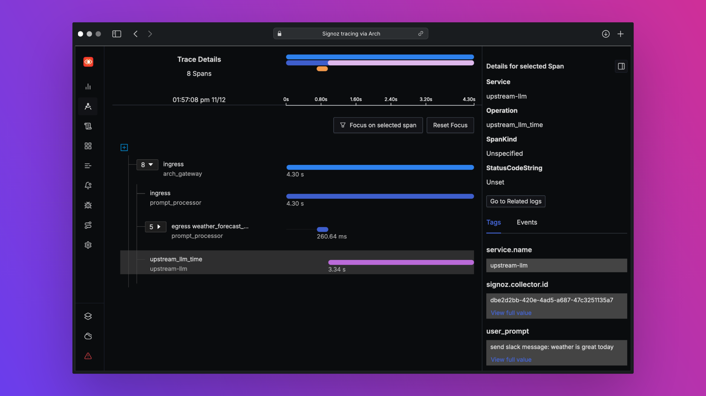

<a href="https://www.producthunt.com/posts/arch-3?embed=true&utm_source=badge-top-post-badge&utm_medium=badge&utm_souce=badge-arch&#0045;3" target="_blank"></a>


[](https://github.com/katanemo/arch/actions/workflows/pre-commit.yml)
[](https://github.com/katanemo/arch/actions/workflows/rust_tests.yml)
[](https://github.com/katanemo/arch/actions/workflows/e2e_tests.yml)
[](https://github.com/katanemo/arch/actions/workflows/static.yml)

## Build fast, observable, and personalized AI agents.

Arch is an intelligent [Layer 7](https://www.cloudflare.com/learning/ddos/what-is-layer-7/) gateway designed to protect, observe, and personalize AI agents with your APIs.

Engineered with purpose-built LLMs, Arch handles the critical but undifferentiated tasks related to the handling and processing of prompts, including detecting and rejecting [jailbreak](https://github.com/verazuo/jailbreak_llms) attempts, intelligently calling "backend" APIs to fulfill the user's request represented in a prompt, routing to and offering disaster recovery between upstream LLMs, and managing the observability of prompts and LLM API calls in a centralized way.

 Arch is built on (and by the core contributors of) [Envoy Proxy](https://www.envoyproxy.io/) with the belief that:

>Prompts are nuanced and opaque user requests, which require the same capabilities as traditional HTTP requests including secure handling, intelligent routing, robust observability, and integration with backend (API) systems for personalization – all outside business logic.*

**Core Features**:
  - Built on [Envoy](https://envoyproxy.io): Arch runs alongside application servers as a separate containerized process, and builds on top of Envoy's proven HTTP management and scalability features to handle ingress and egress traffic related to prompts and LLMs.
  - Function Calling for fast Agents and RAG apps. Engineered with purpose-built [LLMs](https://huggingface.co/collections/katanemo/arch-function-66f209a693ea8df14317ad68) to handle fast, cost-effective, and accurate prompt-based tasks like function/API calling, and parameter extraction from prompts.
  - Prompt [Guard](https://huggingface.co/collections/katanemo/arch-guard-6702bdc08b889e4bce8f446d): Arch centralizes guardrails to prevent jailbreak attempts and ensure safe user interactions without writing a single line of code.
  - Routing & Traffic Management: Arch manages LLM calls, offering smart retries, automatic cutover, and resilient upstream connections for continuous availability.
  - Observability: Arch uses the W3C Trace Context standard to enable complete request tracing across applications, ensuring compatibility with observability tools, and provides metrics to monitor latency, token usage, and error rates, helping optimize AI application performance.

**Jump to our [docs](https://docs.archgw.com)** to learn how you can use Arch to improve the speed, security and personalization of your GenAI apps.

> [!IMPORTANT]
> Today, the function calling LLM (Arch-Function) designed for the agentic and RAG scenarios is hosted free of charge in the US-central region. To offer consistent latencies and throughput, and to manage our expenses, we will enable access to the hosted version via developers keys soon, and give you the option to run that LLM locally. For more details see this issue [#258](https://github.com/katanemo/archgw/issues/258)

## Contact
To get in touch with us, please join our [discord server](https://discord.gg/pGZf2gcwEc). We will be monitoring that actively and offering support there.

## Demos
* [Weather Forecast](demos/weather_forecast/README.md) - Walk through of the core function calling capabilities of arch gateway using weather forecasting service
* [Insurance Agent](demos/insurance_agent/README.md) - Build a full insurance agent with Arch
* [Network Agent](demos/network_agent/README.md) - Build a networking co-pilot/agent agent with Arch

## Quickstart

Follow this quickstart guide to use arch gateway to build a simple AI agent. Laster in the section we will see how you can Arch Gateway to manage access keys, provide unified access to upstream LLMs and to provide e2e observability.

### Prerequisites

Before you begin, ensure you have the following:

1. [Docker System](https://docs.docker.com/get-started/get-docker/) (v24)
2. [Docker compose](https://docs.docker.com/compose/install/) (v2.29)
3. [Python](https://www.python.org/downloads/) (v3.12)

Arch's CLI allows you to manage and interact with the Arch gateway efficiently. To install the CLI, simply run the following command:

> [!TIP]
> We recommend that developers create a new Python virtual environment to isolate dependencies before installing Arch. This ensures that archgw and its dependencies do not interfere with other packages on your system.

```console
$ python -m venv venv
$ source venv/bin/activate   # On Windows, use: venv\Scripts\activate
$ pip install archgw==0.1.6
```

### Build AI Agent with Arch Gateway

In following quickstart we will show you how easy it is to build AI agent with Arch gateway. We will build a currency exchange agent using following simple steps. For this demo we will use `https://api.frankfurter.dev/` to fetch latest price for currencies and assume USD as base currency.

#### Step 1. Create arch config file

Create `arch_config.yaml` file with following content,

```yaml
version: v0.1

listener:
  address: 0.0.0.0
  port: 10000
  message_format: huggingface
  connect_timeout: 0.005s

llm_providers:
  - name: gpt-4o
    access_key: $OPENAI_API_KEY
    provider: openai
    model: gpt-4o

system_prompt: |
  You are a helpful assistant.

prompt_guards:
  input_guards:
    jailbreak:
      on_exception:
        message: Looks like you're curious about my abilities, but I can only provide assistance for currency exchange.

prompt_targets:
  - name: currency_exchange
    description: Get currency exchange rate from USD to other currencies
    parameters:
      - name: currency_symbol
        description: the currency that needs conversion
        required: true
        type: str
        in_path: true
    endpoint:
      name: frankfurther_api
      path: /v1/latest?base=USD&symbols={currency_symbol}
    system_prompt: |
      You are a helpful assistant. Show me the currency symbol you want to convert from USD.

  - name: get_supported_currencies
    description: Get list of supported currencies for conversion
    endpoint:
      name: frankfurther_api
      path: /v1/currencies

endpoints:
  frankfurther_api:
    endpoint: api.frankfurter.dev:443
    protocol: https
```

#### Step 2. Start arch gateway with currency conversion config

```sh

$ archgw up arch_config.yaml
2024-12-05 16:56:27,979 - cli.main - INFO - Starting archgw cli version: 0.1.5
...
2024-12-05 16:56:28,485 - cli.utils - INFO - Schema validation successful!
2024-12-05 16:56:28,485 - cli.main - INFO - Starging arch model server and arch gateway
...
2024-12-05 16:56:51,647 - cli.core - INFO - Container is healthy!

```

Once the gateway is up you can start interacting with at port 10000 using openai chat completion API.

Some of the sample queries you can ask could be `what is currency rate for gbp?` or `show me list of currencies for conversion`.

#### Step 3. Interacting with gateway using curl command

Here is a sample curl command you can use to interact,

```bash
$ curl --header 'Content-Type: application/json' \
  --data '{"messages": [{"role": "user","content": "what is exchange rate for gbp"}]}' \
  http://localhost:10000/v1/chat/completions | jq ".choices[0].message.content"

"As of the date provided in your context, December 5, 2024, the exchange rate for GBP (British Pound) from USD (United States Dollar) is 0.78558. This means that 1 USD is equivalent to 0.78558 GBP."

```

And to get list of supported currencies,

```bash
$ curl --header 'Content-Type: application/json' \
  --data '{"messages": [{"role": "user","content": "show me list of currencies that are supported for conversion"}]}' \
  http://localhost:10000/v1/chat/completions | jq ".choices[0].message.content"

"Here is a list of the currencies that are supported for conversion from USD, along with their symbols:\n\n1. AUD - Australian Dollar\n2. BGN - Bulgarian Lev\n3. BRL - Brazilian Real\n4. CAD - Canadian Dollar\n5. CHF - Swiss Franc\n6. CNY - Chinese Renminbi Yuan\n7. CZK - Czech Koruna\n8. DKK - Danish Krone\n9. EUR - Euro\n10. GBP - British Pound\n11. HKD - Hong Kong Dollar\n12. HUF - Hungarian Forint\n13. IDR - Indonesian Rupiah\n14. ILS - Israeli New Sheqel\n15. INR - Indian Rupee\n16. ISK - Icelandic Króna\n17. JPY - Japanese Yen\n18. KRW - South Korean Won\n19. MXN - Mexican Peso\n20. MYR - Malaysian Ringgit\n21. NOK - Norwegian Krone\n22. NZD - New Zealand Dollar\n23. PHP - Philippine Peso\n24. PLN - Polish Złoty\n25. RON - Romanian Leu\n26. SEK - Swedish Krona\n27. SGD - Singapore Dollar\n28. THB - Thai Baht\n29. TRY - Turkish Lira\n30. USD - United States Dollar\n31. ZAR - South African Rand\n\nIf you want to convert USD to any of these currencies, you can select the one you are interested in."

```

### Use Arch Gateway as LLM Router

#### Step 1. Create arch config file

Arch operates based on a configuration file where you can define LLM providers, prompt targets, guardrails, etc. Below is an example configuration that defines openai and mistral LLM providers.

Create `arch_config.yaml` file with following content:

```yaml
version: v0.1

listener:
  address: 0.0.0.0
  port: 10000
  message_format: huggingface
  connect_timeout: 0.005s

llm_providers:
  - name: gpt-4o
    access_key: $OPENAI_API_KEY
    provider: openai
    model: gpt-4o
    default: true

  - name: ministral-3b
    access_key: $MISTRAL_API_KEY
    provider: mistral
    model: ministral-3b-latest
```

#### Step 2. Start arch gateway

Once the config file is created ensure that you have env vars setup for `MISTRAL_API_KEY` and `OPENAI_API_KEY` (or these are defined in `.env` file).

Start arch gateway,

```
$ archgw up arch_config.yaml
2024-12-05 11:24:51,288 - cli.main - INFO - Starting archgw cli version: 0.1.5
2024-12-05 11:24:51,825 - cli.utils - INFO - Schema validation successful!
2024-12-05 11:24:51,825 - cli.main - INFO - Starting arch model server and arch gateway
...
2024-12-05 11:25:16,131 - cli.core - INFO - Container is healthy!
```

### Step 3: Interact with LLM

#### Step 3.1: Using OpenAI python client

Make outbound calls via Arch gateway

```python
from openai import OpenAI

# Use the OpenAI client as usual
client = OpenAI(
  # No need to set a specific openai.api_key since it's configured in Arch's gateway
  api_key = '--',
  # Set the OpenAI API base URL to the Arch gateway endpoint
  base_url = "http://127.0.0.1:12000/v1"
)

response = client.chat.completions.create(
    # we select model from arch_config file
    model="--",
    messages=[{"role": "user", "content": "What is the capital of France?"}],
)

print("OpenAI Response:", response.choices[0].message.content)

```

#### Step 3.2: Using curl command
```
$ curl --header 'Content-Type: application/json' \
  --data '{"messages": [{"role": "user","content": "What is the capital of France?"}]}' \
  http://localhost:12000/v1/chat/completions

{
  ...
  "model": "gpt-4o-2024-08-06",
  "choices": [
    {
      ...
      "message": {
        "role": "assistant",
        "content": "The capital of France is Paris.",
      },
    }
  ],
...
}

```

You can override model selection using `x-arch-llm-provider-hint` header. For example if you want to use mistral using following curl command,

```
$ curl --header 'Content-Type: application/json' \
  --header 'x-arch-llm-provider-hint: ministral-3b' \
  --data '{"messages": [{"role": "user","content": "What is the capital of France?"}]}' \
  http://localhost:12000/v1/chat/completions
{
  ...
  "model": "ministral-3b-latest",
  "choices": [
    {
      "message": {
        "role": "assistant",
        "content": "The capital of France is Paris. It is the most populous city in France and is known for its iconic landmarks such as the Eiffel Tower, the Louvre Museum, and Notre-Dame Cathedral. Paris is also a major global center for art, fashion, gastronomy, and culture.",
      },
      ...
    }
  ],
  ...
}

```

## [Observability](https://docs.archgw.com/guides/observability/observability.html)
Arch is designed to support best-in class observability by supporting open standards. Please read our [docs](https://docs.archgw.com/guides/observability/observability.html) on observability for more details on tracing, metrics, and logs. The screenshot below is from our integration with Signoz (among others)



## Contribution
We would love feedback on our [Roadmap](https://github.com/orgs/katanemo/projects/1) and we welcome contributions to **Arch**!
Whether you're fixing bugs, adding new features, improving documentation, or creating tutorials, your help is much appreciated.
Please visit our [Contribution Guide](CONTRIBUTING.md) for more details
