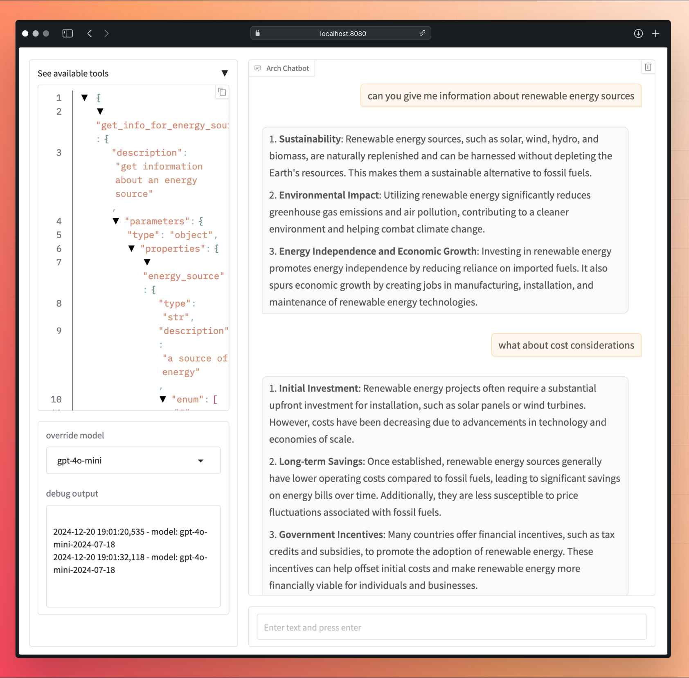

# Multi-Turn Agentic Demo (RAG)

This demo showcases how the **Arch** can be used to build accurate multi-turn RAG agent by just writing simple APIs.



### Energy Source Q/A
Provides information about various energy sources and considerations.

- **Endpoint**: `/agent/energy_source`
- **Parameters**:
  - `energy_source` (`str`, **required**): A source of energy (e.g., `renewable`, `fossil`).
  - `consideration` (`str`, *optional*): A specific type of consideration for an energy source (e.g., `cost`, `economic`, `technology`).

# Starting the demo
1. Please make sure the [pre-requisites](https://github.com/katanemo/arch/?tab=readme-ov-file#prerequisites) are installed correctly
2. Start Arch
   ```sh
   sh run_demo.sh
   ```
3. Navigate to http://localhost:18080
4. Ask "give me information about renewable energy sources"
