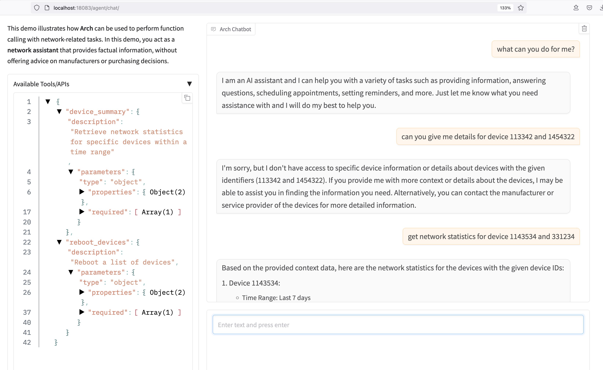

# Network Agent Demo

This demo illustrates how **Arch** can be used to perform function calling with network-related tasks. In this demo, you act as a **network assistant** that provides factual information, without offering advice on manufacturers or purchasing decisions.

The assistant can perform several key operations, including rebooting devices, answering general networking questions, and retrieving device statistics. By default, the system prompt ensures that the assistant's responses are factual and neutral.

## Available Functions:
- **Reboot Devices**: Allows rebooting specific devices or device groups, with an optional time range for scheduling the reboot.
  - Parameters:
    - `device_ids` (required): A list of device IDs to reboot.
    - `time_range` (optional): Specifies the time range in days, defaulting to 7 days if not provided.

- **Network Q/A**: Handles general Q&A related to networking. This function is the default target for general networking queries.

- **Device Summary**: Retrieves statistics for specific devices within a given time range.
  - Parameters:
    - `device_ids` (required): A list of device IDs for which statistics will be retrieved.
    - `time_range` (optional): Specifies the time range in days for gathering statistics, with a default of 7 days.


# Starting the demo
1. Please make sure the [pre-requisites](https://github.com/katanemo/arch/?tab=readme-ov-file#prerequisites) are installed correctly
2. Start Arch
   ```sh
   sh run_demo.sh
   ```
3. Navigate to http://localhost:18080/agent/chat
4. Tell me what can you do for me?"

# Observability
Arch gateway publishes stats endpoint at http://localhost:19901/stats. In this demo we are using prometheus to pull stats from arch and we are using grafana to visalize the stats in dashboard. To see grafana dashboard follow instructions below,

1. Start grafana and prometheus using following command
   ```yaml
   docker compose --profile monitoring up
   ```
1. Navigate to http://localhost:3000/ to open grafana UI (use admin/grafana as credentials)
1. From grafana left nav click on dashboards and select "Intelligent Gateway Overview" to view arch gateway stats

Here is sample interaction


