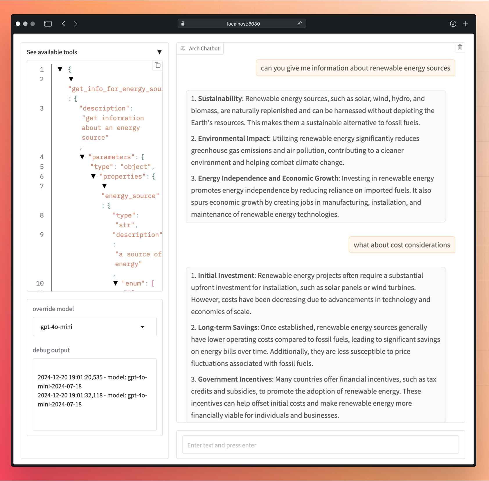

.. _arch_multi_turn_guide:

Multi-Turn
==========
Developers often `struggle <https://www.reddit.com/r/LocalLLaMA/comments/18mqwg6/best_practice_for_rag_with_followup_chat/>`_ to efficiently handle
``follow-up`` or ``clarification`` questions. Specifically, when users ask for changes or additions to previous responses, it requires developers to
re-write prompts using LLMs with precise prompt engineering techniques. This process is slow, manual, error prone and adds latency and token cost for
common scenarios that can be managed more efficiently.

Arch is highly capable of accurately detecting and processing prompts in multi-turn scenarios so that you can buil fast and accurate agents in minutes.
Below are some cnversational examples that you can build via Arch. Each example is enriched with annotations (via ** [Arch] ** ) that illustrates how Arch
processess conversational messages on your behalf.

.. Note::
    The following section assumes that you have some knowledge about the core concepts of Arch, such as :ref:`prompt_targets <arch_overview_prompt_handling>`.
    If you haven't familizaried yourself with Arch's concepts, we recommend you first read the :ref:`tech overview <tech_overview>` section firtst.
    Additionally, the conversation examples below assume the usage of the following :ref:`arch_config.yaml <multi_turn_subsection_prompt_target>` file.

Example 1: Adjusting Retrieval
------------------------------
.. code-block:: text

    User: What are the benefits of renewable energy?
    **[Arch]**: Check if there is an available <prompt_target> that can handle this user query.
    **[Arch]**: Found "get_info_for_energy_source" prompt_target in arch_config.yaml. Forward prompt to the endpoint configured in "get_info_for_energy_source"
    ...
    Assistant: Renewable energy reduces greenhouse gas emissions, lowers air pollution, and provides sustainable power sources like solar and wind.

    User: Include cost considerations in the response.
    **[Arch]**: Follow-up detected. Forward prompt history to the "get_info_for_energy_source" prompt_target and post the following parameters consideration="cost"
    ...
    Assistant: Renewable energy reduces greenhouse gas emissions, lowers air pollution, and provides sustainable power sources like solar and wind. While the initial setup costs can be high, long-term savings from reduced fuel expenses and government incentives make it cost-effective.

Example 2: Switching Intent
---------------------------
.. code-block:: text

    User: What are the symptoms of diabetes?
    **[Arch]**: Check if there is an available <prompt_target> that can handle this user query.
    **[Arch]**: Found "diseases_symptoms" prompt_target in arch_config.yaml. Forward disease=diabeteres to "diseases_symptoms" prompt target
    ...
    Assistant: Common symptoms include frequent urination, excessive thirst, fatigue, and blurry vision.

    User: How is it diagnosed?
    **[Arch]**: New intent detected.
    **[Arch]**: Found "disease_diagnoses" prompt_target in arch_config.yaml. Forward disease=diabeteres to "disease_diagnoses" prompt target
    ...
    Assistant: Diabetes is diagnosed through blood tests like fasting blood sugar, A1C, or an oral glucose tolerance test.

Build Multi-Turn RAG Apps
--------------------------
The following section describes how you can easilly add support for multi-turn scenarios via Arch. You process and manage multi-turn prompts
just like you manage single-turn ones. Arch handles the conpleixity of detecting the correct intent based on the last user prompt and
the covnersational history, extracts relevant parameters needed by downstream APIs, and dipatches calls to any upstream LLMs to summarize the
response from your APIs.

.. _multi_turn_subsection_prompt_target:

Step 1: Define Arch Config
~~~~~~~~~~~~~~~~~~~~~~~~~~~

.. literalinclude:: includes/multi_turn/prompt_targets_multi_turn.yaml
    :language: yaml
    :caption: Arch Config
    :linenos:

Step 2: Process Request in Flask
~~~~~~~~~~~~~~~~~~~~~~~~~~~~~~~~~

Once the prompt targets are configured as above, handle parameters across multi-turn as if its a single-turn request

.. literalinclude:: includes/multi_turn/multi_turn_rag.py
    :language: python
    :caption: Parameter handling with Flask
    :linenos:

Demo App
~~~~~~~~

For your convenience, we've built a `demo app <https://github.com/katanemo/archgw/main/demos/multi_turn_rag_agent>`_
that you can test and modify locally for multi-turn RAG scenarios.

   Example multi-turn user conversation showing adjusting retrieval
